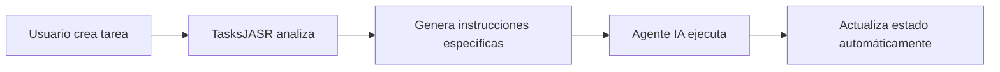

# 🚀 TasksJASR

> **Task Just As Simple & Reliable** - Un servidor MCP inteligente para gestión de tareas que transforma la planificación en ejecución automática.

TasksJASR es un servidor **Model Context Protocol (MCP)** que revoluciona la gestión de tareas al integrar perfectamente la planificación con la ejecución automática a través de agentes IA como Claude Desktop y Kiro IDE.

## ✨ Características Principales

### 🎯 **Gestión Inteligente de Tareas**
- ✅ **CRUD Completo**: Crear, leer, actualizar y eliminar tareas
- ✅ **Detección de Duplicados**: Previene automáticamente tareas repetidas
- ✅ **Persistencia Automática**: Guarda en archivos JSON por proyecto
- ✅ **Estados Dinámicos**: pending → in-progress → completed/failed

### 🤖 **Ejecución Automática con IA**
- ✅ **Instrucciones Específicas**: Genera pasos detallados para el agente IA
- ✅ **Detección de Tipos**: Reconoce automáticamente el tipo de tarea
- ✅ **Herramientas Sugeridas**: Recomienda las herramientas IDE apropiadas
- ✅ **Flujo Completo**: De la idea a la ejecución sin intervención manual

### 📁 **Gestión Inteligente de Directorios**
- ✅ **Detección Automática**: Encuentra el directorio del proyecto actual
- ✅ **Configuración Flexible**: Variables de entorno personalizables
- ✅ **Múltiples Proyectos**: Cada proyecto mantiene sus propias tareas

### 🔗 **Integraciones Avanzadas**
- ✅ **MCP Pensamiento Secuencial**: Convierte planes en tareas ejecutables
- ✅ **Exportación Markdown**: Genera reportes profesionales
- ✅ **Filtrado Avanzado**: Busca tareas por estado, fecha, etc.

## 🚀 Instalación Rápida

### Prerrequisitos
- **Node.js** (v16 o superior)
- **Claude Desktop** o **Kiro IDE**

### 1️⃣ Clonar o Descargar
```bash
# Opción 1: Clonar repositorio
git clone https://github.com/alfredosalgado/tasksjasr.git
cd tasksjasr

# Opción 2: Descargar y extraer ZIP
# Luego navegar a la carpeta extraída
```

### 2️⃣ Instalar Dependencias
```bash
npm install
```

### 3️⃣ Configurar en Claude Desktop

Edita tu archivo de configuración de Claude Desktop:

**📍 Ubicaciones:**
- **Windows:** `%APPDATA%\Claude\claude_desktop_config.json`
- **macOS:** `~/Library/Application Support/Claude/claude_desktop_config.json`

**⚙️ Configuración:**
```json
{
  "mcpServers": {
    "tasksjasr": {
      "command": "node",
      "args": ["RUTA_COMPLETA_A_TASKSJASR/server.js"],
      "cwd": "RUTA_COMPLETA_A_TASKSJASR"
    }
  }
}
```

**💡 Ejemplo Windows:**
```json
{
  "mcpServers": {
    "tasksjasr": {
      "command": "node",
      "args": ["C:/Users/TuNombre/Desktop/tasksjasr/server.js"],
      "cwd": "C:/Users/TuNombre/Desktop/tasksjasr"
    }
  }
}
```

**💡 Ejemplo macOS:**
```json
{
  "mcpServers": {
    "tasksjasr": {
      "command": "node",
      "args": ["/Users/TuNombre/Desktop/tasksjasr/server.js"],
      "cwd": "/Users/TuNombre/Desktop/tasksjasr"
    }
  }
}
```

### 4️⃣ Configuración Avanzada (Opcional)

Para personalizar dónde se guardan las tareas:

```json
{
  "mcpServers": {
    "tasksjasr": {
      "command": "node",
      "args": ["RUTA_COMPLETA_A_TASKSJASR/server.js"],
      "cwd": "RUTA_COMPLETA_A_TASKSJASR",
      "env": {
        "TASKSJASR_WORKING_DIR": "C:/MisProyectos",
        "TASKSJASR_FILE_PATH": "./tasks.json"
      }
    }
  }
}
```

### 5️⃣ ¡Listo!
Reinicia Claude Desktop y ya puedes usar TasksJASR.

---

## 🎮 Uso Rápido

### Primeros Pasos
```
"Antes de crear tareas, revisa dónde se están guardando y actualiza al directorio de este proyecto si es necesario"
```

### Crear Tu Primera Tarea
```
"Añade una tarea para crear archivo index.html con contenido: <h1>Hola TasksJASR</h1>"
```

### Ver Todas las Tareas
```
"Muéstrame todas las tareas actuales"
```

## 💡 Ejemplos de Uso

### 🎯 **Flujo Típico de Trabajo**

1. **Verificar Directorio**
   ```
   "Revisa dónde se están guardando las tareas y actualiza al directorio de este proyecto"
   ```

2. **Crear Tareas Inteligentes**
   ```
   "Añade una tarea para crear archivo styles.css con estilos modernos"
   "Añade una tarea para instalar dependencia express"
   "Añade una tarea para crear componente Header en React"
   ```

3. **Seguimiento y Gestión**
   ```
   "Muestra todas las tareas pendientes"
   "Actualiza la tarea task-1 a estado completed"
   "Genera un reporte en Markdown de todas las tareas"
   ```

### 🤖 **Tipos de Tareas que TasksJASR Reconoce**

| Tipo | Ejemplo | Acción Automática |
|------|---------|-------------------|
| **Crear Archivos** | `"crear archivo index.html"` | Genera código con fsWrite |
| **Instalar Dependencias** | `"instalar dependencia react"` | Ejecuta npm install |
| **Crear Componentes** | `"crear componente Button"` | Genera componente React |
| **Ejecutar Comandos** | `"ejecutar comando npm start"` | Usa terminal/PowerShell |
| **Modificar Archivos** | `"modificar archivo package.json"` | Lee y actualiza archivos |

### 🔄 **Integración con Pensamiento Secuencial**
```
"Importa estas tareas desde el pensamiento secuencial: [datos del MCP]"
```

## 🛠️ Herramientas MCP Disponibles

### 📝 **Gestión de Tareas**
| Herramienta | Descripción | Uso |
|-------------|-------------|-----|
| `add_task` | Crear nueva tarea | `title`, `description` |
| `list_tasks` | Listar tareas | `filter` (opcional) |
| `update_task` | Actualizar tarea | `taskId`, `updates` |
| `delete_task` | Eliminar tarea | `taskId` |

### 🔧 **Ejecución y Control**
| Herramienta | Descripción | Uso |
|-------------|-------------|-----|
| `execute_task` | Ejecutar tarea específica | `taskId` |
| `execute_pending_tasks` | Ejecutar todas las pendientes | - |
| `get_execution_stats` | Ver estadísticas | - |
| `toggle_auto_execute` | Activar/desactivar auto-ejecución | `enabled` |

### 📁 **Gestión de Directorios**
| Herramienta | Descripción | Uso |
|-------------|-------------|-----|
| `get_current_directory` | Ver directorio actual | - |
| `set_working_directory` | Cambiar directorio | `directory` |

### 📊 **Utilidades**
| Herramienta | Descripción | Uso |
|-------------|-------------|-----|
| `export_to_markdown` | Generar reporte MD | - |
| `remove_duplicate_tasks` | Limpiar duplicados | - |
| `import_from_sequential_thinking` | Importar desde MCP | `sequentialThoughtData` |

## Estructura de Datos

### Tarea
```javascript
{
  id: "task-1",
  title: "Título de la tarea",
  description: "Descripción detallada",
  status: "pending", // pending, in-progress, completed
  createdAt: "2024-01-01T00:00:00.000Z"
}
```

### Datos de Pensamiento Secuencial
```javascript
{
  thoughts: [
    {
      id: 1,
      content: "Contenido del pensamiento",
      nextThoughtNeeded: true,
      branchFromThought: null,
      isRevision: false
    }
  ]
}
```

## 🧠 Sistema de Ejecución Automática

### ⚡ **Flujo Inteligente**


### 🎯 **Detección Automática de Tipos**
TasksJASR reconoce automáticamente qué tipo de tarea es y genera instrucciones específicas:

```
✅ TAREA CREADA: Crear archivo de prueba (ID: task-1)

🤖 INSTRUCCIONES PARA EJECUTAR ESTA TAREA:
1. Crear un archivo usando la herramienta fsWrite
2. Nombre del archivo: test.txt
3. Contenido: Hola desde TasksJASR

🔧 HERRAMIENTAS SUGERIDAS: fsWrite
⚡ ACCIÓN REQUERIDA: Por favor, ejecuta estas instrucciones ahora...
```

### 🚫 **Prevención de Duplicados**
```
⚠️ TAREA DUPLICADA DETECTADA

Ya existe una tarea similar:
ID: task-1
Título: Crear estructura HTML básica
Estado: completed

❓ ¿Quieres continuar creando esta tarea duplicada?
```

## 🔧 Configuración Avanzada

### 🌍 **Variables de Entorno**
| Variable | Descripción | Ejemplo |
|----------|-------------|---------|
| `TASKSJASR_WORKING_DIR` | Directorio base de trabajo | `"C:/MisProyectos"` |
| `TASKSJASR_FILE_PATH` | Nombre del archivo de tareas | `"./tasks.json"` |

### 📁 **Estructura de Archivos**
```
tasksjasr/
├── 📄 server.js              # Servidor MCP principal
├── 📄 task_manager.js         # Motor de gestión de tareas
├── 📄 task_executor.js        # Sistema de ejecución automática
├── 📄 package.json            # Configuración del proyecto
├── 📄 README.md               # Esta documentación
├── 📄 integration_guide.md    # Guía de integración avanzada
├── 📄 example_usage.js        # Ejemplos de uso programático
└── 📄 mcp-config.json         # Configuración de ejemplo
```

### 🚀 **Desarrollo**
```bash
# Modo desarrollo (auto-reload)
npm run dev

# Modo producción
npm start
```

---

## 🤝 Contribuir

¡Las contribuciones son bienvenidas! Por favor:

1. Fork el proyecto
2. Crea una rama para tu feature (`git checkout -b feature/AmazingFeature`)
3. Commit tus cambios (`git commit -m 'Add some AmazingFeature'`)
4. Push a la rama (`git push origin feature/AmazingFeature`)
5. Abre un Pull Request

---

## 📞 Soporte

- 🐛 **Issues**: [GitHub Issues](https://github.com/alfredosalgado/tasksjasr/issues)
- 💬 **Discusiones**: [GitHub Discussions](https://github.com/alfredosalgado/tasksjasr/discussions)
- 📧 **Email**: alfresal88@gmail.com

---

## 📄 Licencia

Este proyecto está bajo la Licencia MIT. Ver el archivo `LICENSE` para más detalles.

---

## ⭐ ¿Te Gusta TasksJASR?

Si TasksJASR te ha sido útil, ¡considera darle una estrella en GitHub! ⭐

**Hecho con ❤️ para la comunidad de desarrolladores**